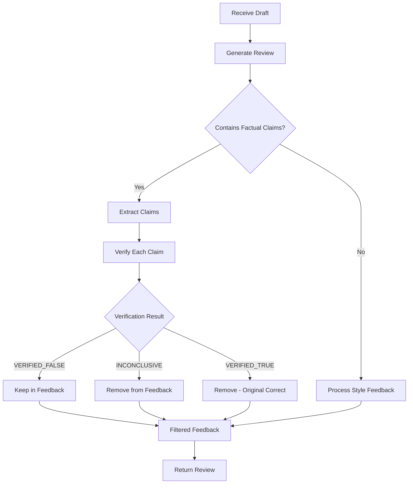
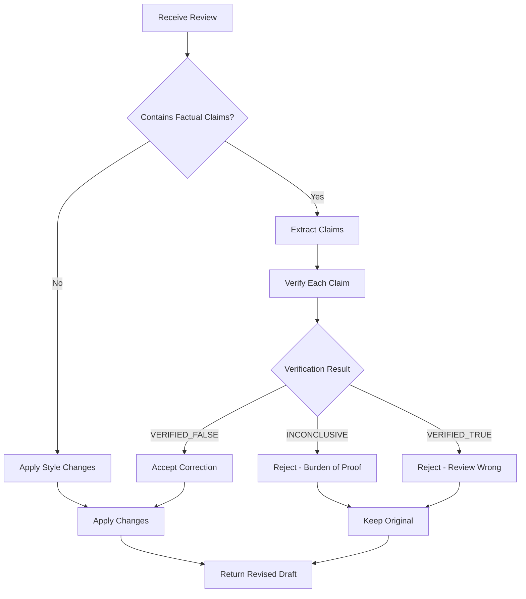

# Fact-Checking Protocol Documentation

## Overview

The Fact-Checking Protocol is a comprehensive system that prevents reviewer and reviser agents from blocking the research workflow based on unverified claims. It enforces mandatory verification through BRAVE search before any factual corrections can be made.

## Problem Statement

Previously, the reviewer and reviser agents had unchecked power to:
- Declare dates/events as "factually incorrect" without verification
- Block entire workflows based on their training data limitations  
- Cause infinite loops and waste resources
- Reject contemporary information they weren't trained on (e.g., 2024-2025 events)

## Solution Architecture

### Core Components

1. **FactChecker Utility** (`multi_agents/agents/utils/fact_checker.py`)
   - Extracts factual claims from review feedback
   - Verifies claims using BRAVE search API
   - Implements burden of proof principle
   - Provides transparent verification logging

2. **Enhanced ReviewerAgent** (`multi_agents/agents/reviewer.py`)
   - Integrates fact-checking before providing feedback
   - Filters out unverified factual claims
   - Preserves style/structure feedback
   - Prevents workflow blocking without evidence

3. **Enhanced ReviserAgent** (`multi_agents/agents/reviser.py`)
   - Verifies review feedback before making changes
   - Rejects unverified corrections
   - Applies only verified factual corrections
   - Maintains original content when claims are inconclusive

## Key Features

### 1. Mandatory Fact Verification

Before declaring ANYTHING as "factually incorrect", agents MUST:
- Extract the specific factual claim
- Formulate an appropriate search query
- Perform BRAVE search verification
- Analyze search results for evidence
- Only proceed if claim is VERIFIED_FALSE with high confidence (>0.8)

### 2. Burden of Proof Principle

The system implements a strict burden of proof:
- If a claim cannot be verified as false → assume it's valid
- Inconclusive results → cannot block workflow
- Search failures → cannot block workflow
- Only VERIFIED_FALSE with high confidence can trigger corrections

### 3. Contemporary Event Awareness

Special handling for recent events (2024-2025):
- Recognizes current year and recent years as contemporary
- Adds freshness parameters to searches
- Prevents rejection of current political figures/events
- Handles temporal confusion in LLM training data

### 4. Verification Status Types

```python
class VerificationStatus(Enum):
    VERIFIED_TRUE = "verified_true"           # Claim is confirmed true
    VERIFIED_FALSE = "verified_false"         # Claim is confirmed false
    INCONCLUSIVE = "inconclusive"            # Cannot determine truth
    SEARCH_FAILED = "search_failed"          # Search error occurred
    NO_VERIFICATION_NEEDED = "no_verification_needed"  # Non-factual claim
```

### 5. Transparent Logging

All verification attempts are logged with:
- The original claim
- Search query used
- Verification status
- Confidence level
- Evidence sources
- Timestamp
- Error messages (if any)

## Workflow Integration

### Reviewer Agent Flow



### Reviser Agent Flow



## Usage Examples

### Example 1: Contemporary Event Handling

**Original Draft:**
```markdown
In January 2025, President Donald Trump announced new AI regulations.
```

**Reviewer Feedback (Pre-Protocol):**
```
The report incorrectly states Donald Trump is president in 2025.
This is a future event that hasn't happened yet.
```

**With Fact-Checking Protocol:**
1. Claim extracted: "Donald Trump is president in 2025"
2. BRAVE search performed with query: "Donald Trump president 2025 fact check verify"
3. Result: INCONCLUSIVE (cannot verify as false)
4. Action: Feedback rejected, draft accepted as valid

### Example 2: Verifiable Error

**Original Draft:**
```markdown
The Eiffel Tower was built in 1989 in Paris.
```

**Reviewer Feedback:**
```
The Eiffel Tower was built in 1889, not 1989.
```

**With Fact-Checking Protocol:**
1. Claim extracted: "The Eiffel Tower was built in 1989"
2. BRAVE search performed
3. Result: VERIFIED_FALSE (confidence: 0.9)
4. Action: Correction accepted and applied

### Example 3: Style Feedback (Non-Factual)

**Reviewer Feedback:**
```
The introduction lacks clarity and the structure could be improved.
Consider adding more transitions between sections.
```

**With Fact-Checking Protocol:**
1. No factual claims detected
2. Style/structure feedback preserved
3. Action: Feedback passed through unchanged

## Configuration

### Environment Variables

```bash
# Required for fact-checking
BRAVE_API_KEY=your_brave_api_key

# Optional configuration
FACT_CHECK_CONFIDENCE_THRESHOLD=0.8  # Minimum confidence for VERIFIED_FALSE
FACT_CHECK_MAX_SEARCH_RESULTS=10     # Maximum search results to analyze
FACT_CHECK_TIMEOUT=10                # Search timeout in seconds
```

### Customization

The fact-checking behavior can be customized by modifying:

1. **Factual claim indicators** - Keywords that identify factual claims
2. **Style indicators** - Keywords that identify non-factual feedback
3. **Confidence threshold** - Minimum confidence required to block workflow
4. **Contemporary years** - Years considered as current/recent

## Testing

### Unit Tests

```bash
# Test fact checker utility
python -m pytest tests/test_fact_checker.py

# Test reviewer integration
python -m pytest tests/test_reviewer_fact_checking.py

# Test reviser integration
python -m pytest tests/test_reviser_fact_checking.py
```

### Integration Test

```bash
# Run comprehensive test suite
python test_fact_checking.py
```

### Manual Testing

1. Create a draft with contemporary dates (2024-2025)
2. Run through reviewer agent
3. Verify that temporal confusion doesn't block workflow
4. Check verification logs for transparency

## Safeguards

### 1. Fallback Handling

If BRAVE API is unavailable:
- Fact-checking returns SEARCH_FAILED status
- Burden of proof applies - workflow continues
- Warning logged but workflow not blocked

### 2. Rate Limiting

The system includes rate limiting protection:
- Caches verification results for identical claims
- Batches searches when possible
- Implements exponential backoff on failures

### 3. Human Override

Human feedback can override fact-checking:
- Human agent feedback bypasses verification
- Manual corrections always accepted
- Override logged for audit trail

## Metrics and Monitoring

### Key Metrics

1. **Verification Attempts** - Total number of fact checks performed
2. **Verification Success Rate** - Percentage of successful verifications
3. **False Positive Rate** - Claims incorrectly marked as false
4. **Workflow Block Rate** - How often workflow is blocked
5. **Average Verification Time** - Time taken for fact checking

### Verification Report

Generate a detailed report:

```python
fact_checker = get_fact_checker()
report = fact_checker.generate_verification_report()
print(report)
```

Output includes:
- Total verifications performed
- Breakdown by verification status
- Evidence sources used
- Confidence distributions
- Error summary

## Best Practices

### For Developers

1. **Always verify before blocking** - Never block workflow without verification
2. **Log transparently** - Record all verification attempts
3. **Handle failures gracefully** - API failures shouldn't break workflow
4. **Test with contemporary content** - Ensure current events are handled
5. **Monitor confidence levels** - Adjust thresholds based on performance

### For Users

1. **Provide context** - More context improves verification accuracy
2. **Check logs** - Review verification logs for transparency
3. **Report false positives** - Help improve the system
4. **Use human override** - When you know better than the system

## Troubleshooting

### Common Issues

1. **"BRAVE API key not found"**
   - Set `BRAVE_API_KEY` environment variable
   - System continues with limited verification

2. **"All claims inconclusive"**
   - Normal for novel or very recent information
   - Burden of proof prevents blocking
   - Workflow continues normally

3. **"Verification timeout"**
   - Network or API issues
   - System applies burden of proof
   - Check internet connection

4. **"High false positive rate"**
   - Adjust confidence threshold
   - Review claim extraction patterns
   - Check search query formulation

## Future Enhancements

1. **Multi-source verification** - Use multiple search providers
2. **Claim caching** - Cache verified claims across sessions
3. **Machine learning confidence** - Learn optimal confidence thresholds
4. **Claim similarity matching** - Identify similar previously verified claims
5. **Real-time fact database** - Build knowledge base of verified facts

## Conclusion

The Fact-Checking Protocol ensures that the multi-agent research system:
- Cannot be blocked by unverified claims
- Handles contemporary events correctly
- Maintains transparency through logging
- Applies burden of proof principle
- Preserves workflow efficiency

This protocol transforms the reviewer and reviser agents from potential bottlenecks into reliable, evidence-based components of the research pipeline.